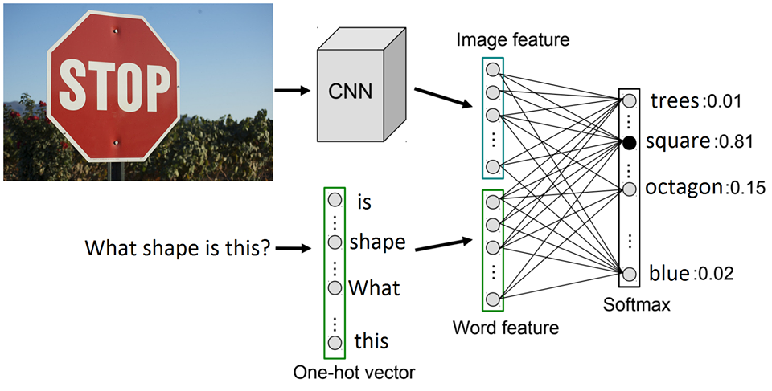
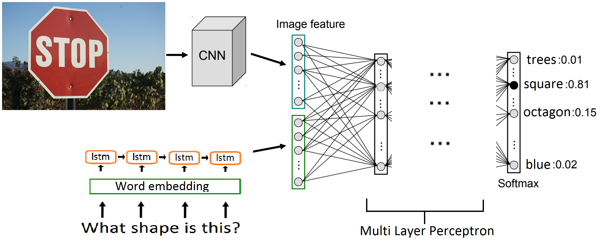
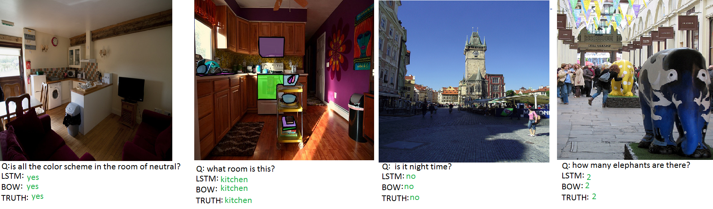
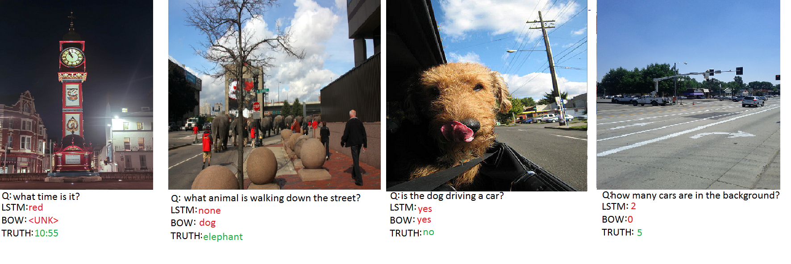
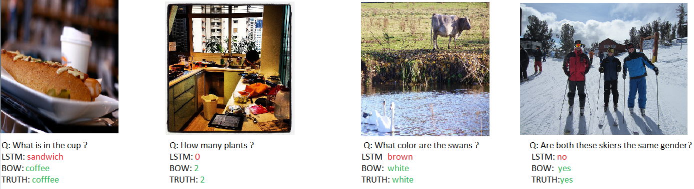
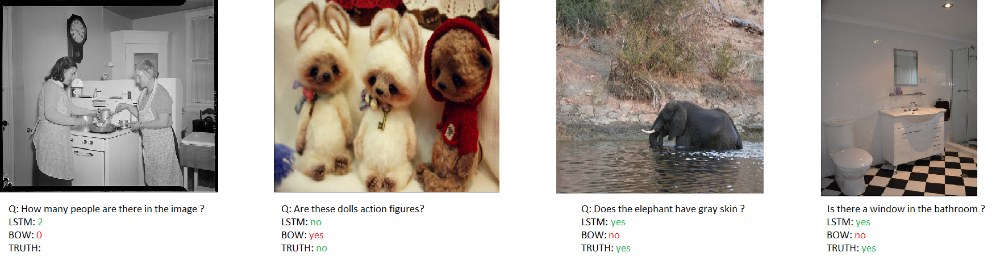

# Exploring model architectures for Visual Question Answering
This repository contains the corresponding training code for [**the project**](https://www.overleaf.com/read/czcchvjrjjgz).

We address the problem of Visual Question Answering, which requires both image and language understanding to answer a question about a given photograph. We describe 2 models for this task: a simple bag-of-words baseline and an improved Long Short Term Memory-based approach.

### Bag of Words model

  

### LSTM model

  

## Training 
1. Download the [data](https://github.com/timbmg/NLP1-2017-VQA) and place it in the [data folder](data/).
2. Check the [available parser options](application.py).
4. Train the networks using the provided [file](application.py):
`python application.py --model_type bow|lstm`
## Results 

### Both models are correct

  

### Both models are wrong

  

### Only BoW is correct

  

### Only LSTM is correct

  

